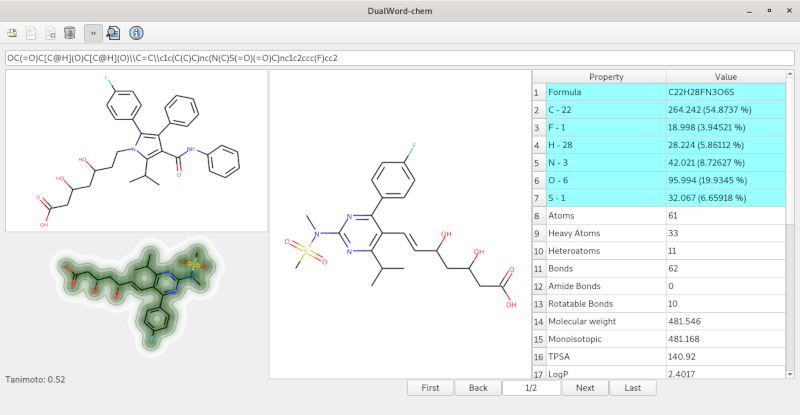

DualWord-chem - open-source 2D chemical viewer.

Features:  
 - supported formats: SDF, SMILES  
 - export to SVG  
 - molecular descriptors  
 - chemical similarity, similarity maps  
	
Third Party Software:  
 - Qt License: LGPL v3  
 - RDKit License: BSD  

License: GNU GENERAL PUBLIC LICENSE Version 3  
Source code: https://github.com/dualword/dualword-chem  
Files: https://sourceforge.net/projects/dualword-chem  

