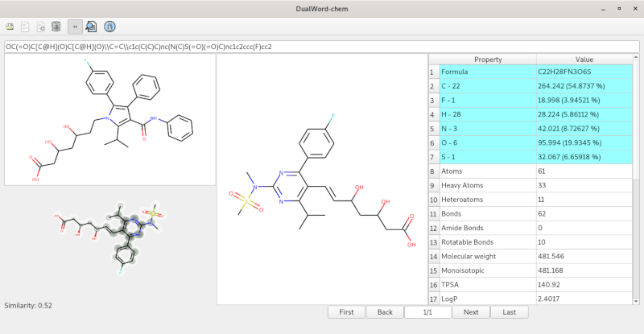

DualWord-chem - open-source chemical viewer.

Features:  
 - supported formats: SDF, SMILES  
 - export to SVG  
 - molecular descriptors  
	
Third Party Software:  
 - Qt 4.8.6 License: LGPL v2.1  
 - RDKit 2016.03.1 License: BSD  

License: GNU GENERAL PUBLIC LICENSE Version 3  
Source code: http://github.com/dualword/dualword-chem  

